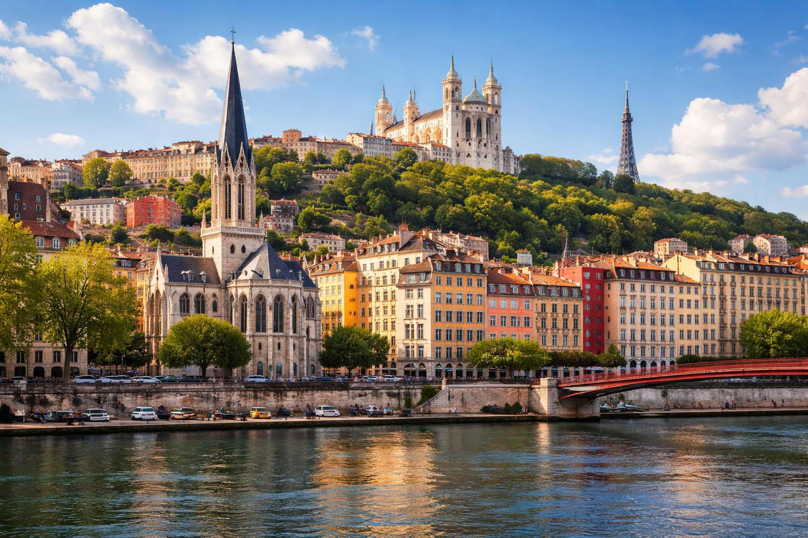
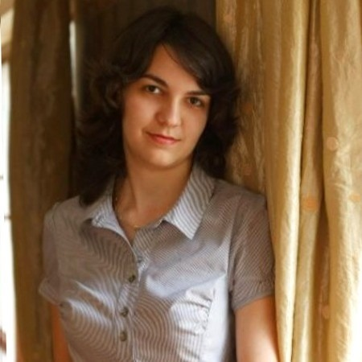
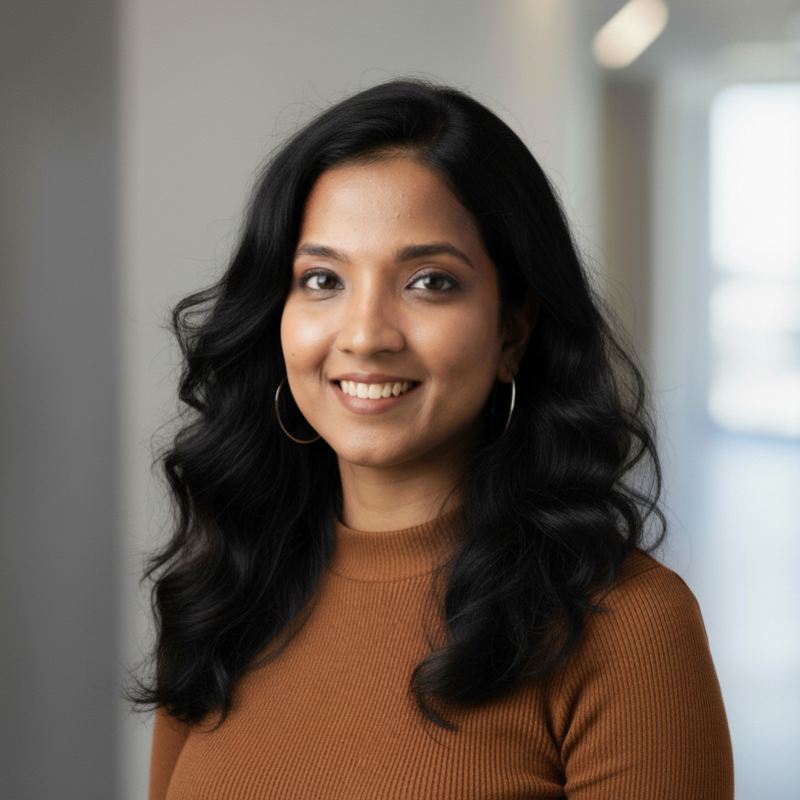

|  |
|:--:|
|  |

# **Workshop on *The Art of Compressing LLMs*: Pruning, Distillation, and Quantization Demystified (1st Edition)**

### **Co-located with the 28th International Conference on Pattern Recognition (ICPR 2026)**

**Location:** Lyon, France  
**Dates:** August 21–22, 2026

***

## **Overview**

As Large Language Models (LLMs) grow in complexity, the computational cost of inference and training has become a significant barrier for the Pattern Recognition and HPC communities.  
This workshop explores the art and engineering of compressing these models to make them cheaper, faster, and easier to deploy while strictly preserving practical capability.

We move beyond pure theory to demonstrate how pruning and quantization interact with actual hardware constraints on the NVIDIA stack. Participants will engage with foundational concepts and advanced implementation patterns designed to maximize GPU utilization and reduce end-to-end time-to-solution.

***

## **Topics of Interest**

We invite practitioners and researchers to explore a range of topics centered on model efficiency, including:

*   ML Model Optimization
*   Large Language Models (LLMs) and Generative AI in HPC
*   Pruning, Quantization, and Knowledge Distillation techniques
*   Hardware constraints and real-world production workloads
*   Industrial use cases of HPC, ML, and deep learning

***

## **Workshop Goals**

*   **Demystify Compression:** Bridge the gap between theoretical research and practical hardware application.
*   **Enable Efficient Deployment:** Equip the community with actionable "recipes" and design trade-offs for immediate implementation.
*   **Skill Building:** Provide strategies to improve node-level throughput and maximize hardware efficiency.

***

## **Format & Schedule**

This is a **Full-Day Workshop**.  
The agenda is modular and includes specialized lab sessions designed to provide hands-on experience with compression implementation.

*   **Workshop Dates:** August 22, 2026 (following the main ICPR conference)
*   **Format:** In-person (Lyon, France)

***

## **Important Dates**

*   **ICPR Main Conference:** August 17–20, 2026
*   **Workshop:** August 21–22, 2026
*   Paper Submission :  April 30, 2026
*   Notifications to Authors :  May 31, 2026
*   Camera Ready Papers Due : June 20, 2026
*   Workshop Event : August 22, 2026

## Organisers

### Lavinia Ghita

Lavinia is a Solutions Architect Manager at NVIDIA, leading the EMEA technical team for the Financial Services Industry (FSI). Her work focuses on large‑scale AI systems, with emphasis on distillation methods, domain‑adaptation techniques and model compression methods for efficient AI pipelines. Her research also covers foundation‑model architectures for time‑series analysis and the development of general methods for modelling structure and latent dynamics in temporal processes. Prior to NVIDIA, Lavinia worked on research and applications in this space at a quantitative hedge fund and in big tech. She holds advanced degrees in Mathematics from the École Polytechnique Fédérale de Lausanne (EPFL).

---

### Liana Mikaelyan

Liana Mikaelyan is a Senior Solutions Architect at NVIDIA, specializing in model compression as well as training and inference for efficient deployment of LLMs. Prior to joining NVIDIA, she worked as an applied scientist at Microsoft, where she developed methods for injecting knowledge into LLMs and enabling on-device LLM capabilities. With a background in mathematics, she holds an MSc in Machine Learning from University College London.

---

### Sergio Perez

Sergio Perez is a Senior Solution Architect at NVIDIA specialised in training and inference of LLMs. He has experience both in research and industrial application of Generative AI and scientific computing, having completed his PhD at Imperial College London and worked as an AI engineer at Graphcore and Amazon. Sergio has contributed to deep learning courses in Coursera and NVIDIA's Deep Learning Institute, reaching more than 50k students worldwide.

---

### Harshita Seth

Harshita is a Senior Solution Architect at Nvidia, focusing on driving AI adoption among Global System Integrators. She has experience in building and deploying large language models, with a particular focus on applications in the audio domain. Prior to joining Nvidia, she was part of the Samsung Research team, where she contributed to the development of customized on-device AI applications for Samsung phones. In her current role, Harshita leverages her deep expertise to design cutting-edge AI solutions and empower partners to integrate advanced technologies seamlessly into their workflows.
